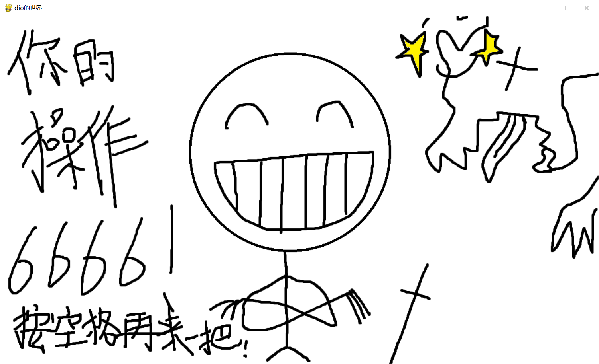

# Brave Dragon Quest: 终极丐版勇者斗恶龙小游戏
 本人很久以前闲着没事干做的破烂小游戏，烂在电脑力里还不如分（自）享（爆）一波。美术：SWY666, 程序：SWY666, 发行：SWY666, 总之全TM是SWY666。

## 运行条件
 这游戏用pygame写的，所以只需要你在python环境下安装pygame (pip install pygame)就可以直接跑了，没啥配置要求，纯4399小中之小游戏。

## 游戏时注意条件
 看起来目前玩的时候要切**英文输入法**，不然这破pygame似乎不能监听键盘事件，有没有懂哥在issue里说一下怎么解决XD。

## 游戏截图 (搞得和真的一样)
### 封面

### 战斗画面1（南无三，何等激烈的打斗！）

### 战斗画面1（南无三，何等激烈的打斗！）

### 战 斗 失 败，黑 暗 降 临

### 胜 利 结 算 画 面

